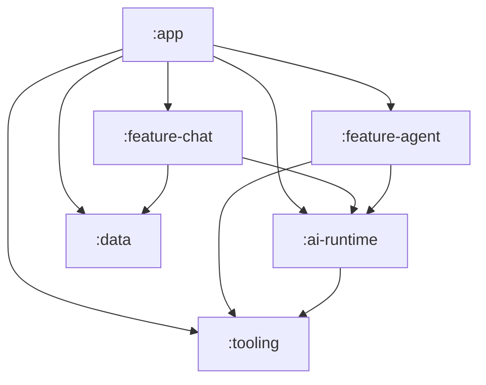

# High-Level Design (HLD)

This document describes the high-level architecture of the AI-Native Android sample application. The architecture is designed to cleanly separate UI concerns from AI orchestration, ensuring that the heavy lifting of running on-device LLMs does not bleed into the presentation layers.

## 1. Architectural Principles

*   **Modularization:** Code is strictly segregated by feature and domain to avoid circular dependencies and enforce separation of concerns.
*   **Interface Segregation & Strategy Pattern:** Concrete implementations of AI clients (like Google's AICore vs. a Mock Simulator) are hidden behind the `GeminiNanoClient` interface in the `:ai-runtime` module.
*   **Runtime Engine Swapping:** Dependency Injection (Dagger Hilt) uses custom Qualifiers (`@RealNano`, `@FakeNano`) to inject both AI engines. The Orchestrator dynamically routes tasks based on UI state (e.g. a toggle switch).
*   **Event-Driven Observability:** AI orchestration states are broadcasted globally via a generic Event bus (SharedFlow) in the `:tooling` module, allowing disjoint UI modules to react to background tasks.
*   **Dependency Inversion:** Repositories and AI Clients are injected via Dagger Hilt.

## 2. Module Breakdown

The application is split into the following Gradle modules:

*   **`:app`**: The application shell. It wires up the navigation graph, sets up the main Hilt `@HiltAndroidApp` application class, and acts as the entry point.
*   **`:feature-chat`**: Contains the UI for displaying the chat thread and the draft editor. Holds the `ChatViewModel` which interacts with data repositories and triggers AI orchestration.
*   **`:feature-agent`**: Contains the UI for the "Agent Observability Sheet". Holds the `ExecutionStateViewModel` which listens to internal AI events to render a real-time log.
*   **`:ai-runtime`**: The brain of the application. Contains the `AdkOrchestrator` (the agent logic) and the `GeminiNanoClient` interface.
*   **`:data`**: Pure data layer. Contains the Room database, DAOs, and Repositories for persisting user chat messages.
*   **`:tooling`**: Contains the `AgentLogger` and the definitions for `ExecutionEvent`. It acts as the shared dependency for modules that either generate logs (`:ai-runtime`) or consume logs (`:feature-agent`).

## 3. Module Dependency Graph

### Dependency Rules:
1. UI Features (`:feature-chat`, `:feature-agent`) do not depend on each other.
2. The `:tooling` module is a lightweight pure-Kotlin (or Android library) module at the bottom of the graph to avoid bringing heavy Android SDK dependencies to the orchestration layers.
3. The `:ai-runtime` has no UI dependencies. It orchestrates logic and relies purely on data and tooling.

## 4. Key Design Decisions

### Why separate `:ai-runtime` from `:feature-chat`?
If the app were to scale, multiple features (e.g., Email Drafts, Settings Summaries) might need AI access. Placing the Orchestrator and Nano Client in `:ai-runtime` prevents duplicating AI integration logic and allows for robust, isolated unit testing of the agent's decision tree.

### Why use an Agent Logger?
In typical applications, business logic returns a single result. Agentic AI workflows, however, involve multiple "thinking" and "tool-calling" steps that take time. Using a reactive `AgentLogger` allows the UI to show the user exactly what the AI is doing, building trust and demonstrating advanced orchestration.
