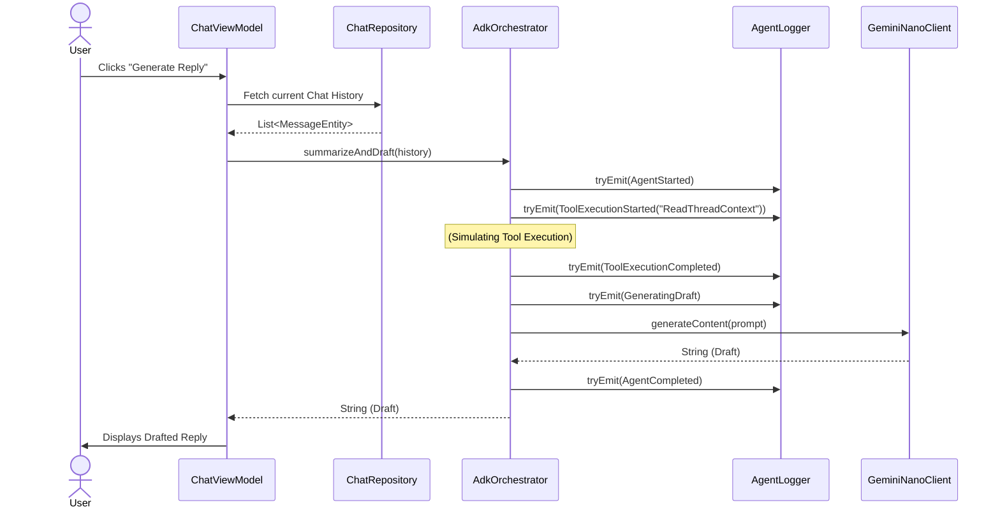

# Low-Level Design (LLD)

This document provides a detailed look at the data flows, class structures, and component relationships within the AI-Native Android sample architecture.

## 1. Class Architectures

### AI Runtime & Orchestration (`:ai-runtime`)
The orchestration layer handles the multi-step reasoning and generation loops.

*   `GeminiNanoClient` (Interface): An abstraction layer that defines how the system requests generations.
    *   `FakeGeminiNanoClient`: Simulates on-device generation delay for demo purposes.
    *   `RealGeminiNanoClient`: Integrates directly with Google AICore (`com.google.ai.edge.aicore`).
*   `AdkOrchestrator`: The primary agent. It coordinates data gathering, logging, and generation.
    *   **Dependency Injection:** Uses Qualifiers (`@FakeNano`, `@RealNano`) to inject both clients.
    *   **Method:** `summarizeAndDraft(chatHistory: List<String>, useRealNano: Boolean): String`
    *   It sequentially broadcasts `ExecutionEvent`s to the `AgentLogger` while transitioning through phases, and selects the engine dynamically based on the boolean flag.

### Tooling & Observability (`:tooling`)
This module handles tracing.

*   `ExecutionEvent` (Sealed Class): Models the individual states of the Agent Orchestrator.
    *   `AgentStarted`, `ToolExecutionStarted`, `ToolExecutionCompleted`, `GeneratingDraft`, `AgentCompleted`, `Error`.
*   `AgentLogger`: A singleton injected via Hilt holding a `MutableSharedFlow<ExecutionEvent>`. It buffers events and replays them to active subscribers (like the Observability UI).

### Data Layer (`:data`)
Manages standard persistence.

*   `MessageEntity`: Room database entity representing a single chat message (ID, text, isFromUser, timestamp).
*   `ChatDao`: Room DAO interfaces (`getAllMessages()`, `insertMessage()`).
*   `ChatRepository`: Wraps the DAO to provide clean Kotlin `Flow<List<MessageEntity>>` to the ViewModels.

## 2. Sequence Diagram: "Summarize & Draft" Flow

The core feature of the application is delegating the response drafting to the AI Agent.

## 3. Reactive UI State Management

State in the UI is managed strictly via `StateFlow` to follow Android's official Unidirectional Data Flow (UDF) recommendations.

### `ChatViewModel`
*   `messages: Flow<List<MessageEntity>>`: Directly reads the room DB stream.
*   `draft: StateFlow<String>`: Holds the agent's drafted text.
*   `isGenerating: StateFlow<Boolean>`: Used to show loading states and disable UI buttons while the agent orchestrator is suspended.
*   `useRealNano: StateFlow<Boolean>`: Controls the UI switch for swapping between Simulated NPU and Real AICore.

### `ExecutionStateViewModel`
*   Listens to the `AgentLogger.events` (`SharedFlow`).
*   Accumulates events into a local `List<ExecutionEvent>` via `StateFlow` for the `AgentObservabilitySheet` to render via a Jetpack Compose `LazyColumn`.

## 4. Testing Strategy

Using `kotlinx-coroutines-test`, we rigorously test these layers:
*   **Orchestration Tests:** Using `StandardTestDispatcher`, we inject a mock `AgentLogger` and verify that `AdkOrchestrator` emits exactly 5 expected events in order, while yielding correctly to allow collection.
*   **ViewModel Tests:** By utilizing `Dispatchers.setMain()`, we verify that `ChatViewModel` transitions `isGenerating` from `false` -> `true` -> `false` and properly maps the `AdkOrchestrator` output to the `draft` state.
